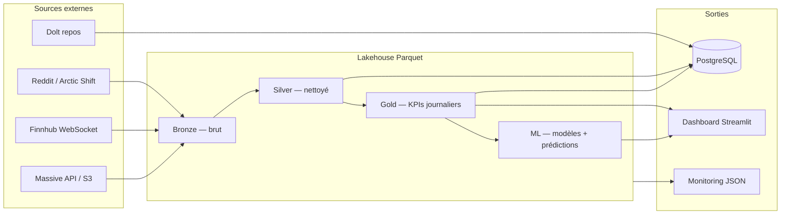
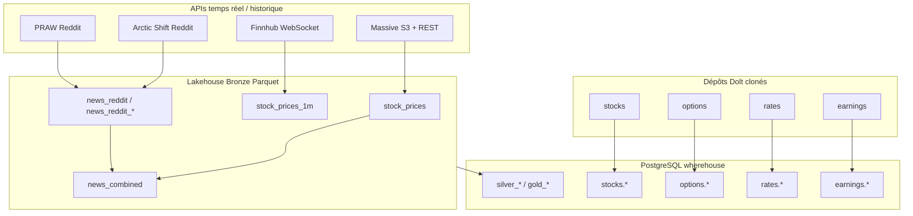

# Data Lakehouse — Daily News for Stock Market Prediction

Projet d'architecture **DataX** : un lakehouse **Medallion** (Bronze / Silver / Gold) qui combine **cours boursiers**, **actualités Reddit** et **machine learning** pour analyser et prédire la direction du marché.

---

## Sommaire

1. [Objectif du projet](#objectif-du-projet)
2. [Vue d'ensemble](#vue-densemble)
3. [Démarrage rapide](#démarrage-rapide)
4. [Prérequis et installation](#prérequis-et-installation)
5. [Configuration](#configuration)
6. [Architecture des données](#architecture-des-données)
7. [Sources d'ingestion (détail)](#sources-dingestion-détail)
8. [Pipeline ELT](#pipeline-elt)
9. [Machine learning](#machine-learning)
10. [Dashboard Streamlit](#dashboard-streamlit)
11. [Market Carpet](#market-carpet)
12. [PostgreSQL et import Dolt](#postgresql-et-import-dolt)
13. [Docker — profils et services](#docker--profils-et-services)
14. [Streaming temps réel (Finnhub)](#streaming-temps-réel-finnhub)
15. [Spark et Airflow](#spark-et-airflow)
16. [Stockage local ou HDFS](#stockage-local-ou-hdfs)
17. [Exécution complète](#exécution-complète)
18. [Structure du code](#structure-du-code)
19. [Tests](#tests)
20. [Technologies](#technologies)

---

## Objectif du projet

Ce dépôt implémente une chaîne de traitement de bout en bout :

| Étape | Rôle |
|-------|------|
| **Ingestion** | Multi-sources : OHLCV (Massive, Finnhub), marchés structurés Dolt → PostgreSQL (actions, options, taux, résultats), titres Reddit (4 subreddits) — voir [Sources d'ingestion](#sources-dingestion-détail) |
| **Transformation** | Nettoyer, enrichir et agréger les données (couches Silver et Gold) |
| **Prédiction** | Classifier la direction du marché (hausse/baisse) à partir des titres Reddit (TF-IDF) et des KPIs |
| **Visualisation** | Dashboard interactif (parcours des données, KPIs, prévisions, market carpet S&P 500) |
| **Orchestration** | Pipeline CLI, Docker ou Airflow avec monitoring (latence, coût, qualité) |

**Cas d'usage principal** : analyser le lien entre l'activité Reddit et les mouvements du DJIA (**DIA**), avec des données de marché enrichies (OHLCV multi-symboles, options, taux, bilans) pour le dashboard et le ML sur **AAPL**, **MSFT**, **GOOGL**, **AMZN**, **NVDA**, **META**, **TSLA**, **JPM**, **XOM**.

---

## Vue d'ensemble



**En une phrase** : les données brutes arrivent en Bronze, sont nettoyées en Silver, agrégées en Gold, alimentent un modèle ML, puis sont exposées dans PostgreSQL et le dashboard.

---

## Démarrage rapide

### Option A — Dashboard seul (le plus simple)

Si le dossier `lakehouse/` contient déjà des données (fournies ou générées) :

```bash
pip install -r requirements.txt
cp .env.example .env          # puis renseigner les clés API si besoin
python scripts/run_dashboard.py
```

→ Ouvrir **http://localhost:8502**

### Option B — Pipeline complet en local

```bash
pip install -r requirements.txt
cp .env.example .env

# Lit le bronze existant, transforme, agrège, entraîne le ML
python pipeline/run_pipeline.py --massive --predict-year 2026

python scripts/run_dashboard.py
```

### Option C — Stack Docker (PostgreSQL + dashboard)

```bash
cp .env.example .env
docker compose up -d dashboard
```

→ Dashboard : **http://localhost:8502** — PostgreSQL : `localhost:5432` (voir [Configuration](#configuration))

### Option D — Cluster complet (HDFS + Spark + Airflow)

```bash
docker compose --profile hdfs --profile spark --profile airflow up -d --build
```

| Interface | URL |
|-----------|-----|
| Dashboard HDFS | http://localhost:8503 |
| HDFS NameNode | http://localhost:9870 |
| Spark UI | http://localhost:8080 |
| Airflow | http://localhost:8081 (`admin` / `admin`) |

---

## Prérequis et installation

- **Python 3.10+**
- **Docker & Docker Compose** (optionnel, pour HDFS, Airflow, PostgreSQL)
- Clés API selon les fonctionnalités utilisées (voir [Configuration](#configuration))

```bash
git clone <url-du-repo>
cd "Daily News for Stock Market Prediction"
pip install -r requirements.txt
```

---

## Configuration

Copier `.env.example` vers `.env` et renseigner les variables nécessaires :

| Variable | Usage |
|----------|-------|
| `FINNHUB_TOKEN` | Streaming OHLCV temps réel (WebSocket) |
| `MASSIVE_API_KEY` | Prix journaliers historiques (REST) |
| `MASSIVE_S3_ACCESS_KEY` / `MASSIVE_S3_SECRET_KEY` | Cache flat files Massive (optionnel) |
| `REDDIT_CLIENT_ID` / `REDDIT_CLIENT_SECRET` | Mode `--praw` uniquement |
| `STORAGE_BACKEND` | `local` (défaut) ou `hdfs` |
| `PGHOST`, `PGPORT`, `PGDATABASE`, `PGUSER`, `PGPASSWORD` | Connexion PostgreSQL |

> Ne jamais committer le fichier `.env`. Les identifiants par défaut du compose Docker sont documentés dans `.env.example`.

---

## Architecture des données

```
lakehouse/                     ← Source de vérité (Parquet)
├── bronze/                    ← Données brutes + métadonnées d'ingestion
│   ├── stock_prices/          ← OHLCV DJIA journalier (Massive API ou import)
│   ├── stock_prices_1m/       ← OHLCV 1 min temps réel (Finnhub WebSocket)
│   ├── news_reddit/           ← Headlines Reddit (agrégé)
│   ├── news_reddit_*/         ← Par subreddit (wallstreetbets, investing, …)
│   ├── news_combined/         ← Labels ML + Top1..Top25 (dérivé)
│   └── massive/day_aggs/      ← Cache flat files Massive (optionnel)
├── silver/                    ← Nettoyage + enrichissement
├── gold/                      ← KPIs journaliers (schéma fixe)
└── ml/                        ← Modèles, prédictions et métriques
    ├── market_direction_model.joblib   ← Modèle global DIA
    ├── AAPL/, MSFT/, …                 ← Un dossier par symbole

monitoring/                    ← Rapports JSON (coût, latence, qualité)
```

### Types de données

| Type | Table Bronze | Description |
|------|--------------|-------------|
| Structuré | `stock_prices` | OHLCV DJIA journalier (Date, Open, High, Low, Close, Volume) |
| Structuré | `stock_prices_1m` | OHLCV 1 min temps réel Finnhub (DIA) |
| Non structuré | `news_reddit` | Titres Reddit par date |
| Hybride | `news_combined` | News + label ML (0 = baisse, 1 = hausse) |

**Subreddits par défaut** : `stocks`, `wallstreetbets`, `StockMarket`, `investing`.

---

## Sources d'ingestion (détail)

Le projet ne s'appuie pas sur une seule API : les données arrivent par **deux chemins complémentaires** (lakehouse Parquet + entrepôt PostgreSQL).



### 1. Données structurées — Lakehouse (pipeline Medallion)

Ces flux alimentent `lakehouse/bronze/` puis Silver / Gold.

| Source | Script / service | Table Bronze | Contenu |
|--------|------------------|--------------|---------|
| **Massive** (flat files S3) | `scripts/fetch_massive_day_aggs.py`, pipeline `--massive` | `stock_prices`, `massive_day_aggs` | OHLCV **journalier** ETF DIA (cache gzip S3, prioritaire) |
| **Massive** (REST API) | `scripts/fetch_massive_rest.py` | `stock_prices` | Fallback si pas de cache S3 (`MASSIVE_API_KEY`) |
| **Finnhub** (WebSocket) | `scripts/stream_finnhub_ohlcv.py`, service `finnhub-stream` | `stock_prices_1m` (défaut) ou `stock_prices` (mode `day`) | Bougies **1 min** ou jour en cours, symbole `FINNHUB_SYMBOL` (défaut DIA) |

Ordre de priorité Massive : **cache S3** → téléchargement S3 → **API REST**.

### 2. Données structurées — PostgreSQL (import Dolt)

Données de marché **multi-actifs** importées depuis des dépôts [Dolt](https://www.dolthub.com/) clonés dans `ubuntu-box`, puis chargées dans PostgreSQL (`scripts/dolt_to_postgres.py`). Un **schéma par dépôt** :

| Clone Dolt | Schéma PG | Domaine | Tables principales |
|------------|-----------|---------|-------------------|
| `haftomt/stocks` | `stocks` | Actions | `ohlcv`, `symbol`, `dividend`, `split` |
| `post-no-preference/options` | `options` | Dérivés | `option_chain` |
| `post-no-preference/rates` | `rates` | Macro | `us_treasury` |
| `post-no-preference/earnings` | `earnings` | Fondamentaux | `earnings_calendar`, `eps_estimate`, `eps_history`, `income_statement`, `balance_sheet_*`, `cash_flow_statement`, `sales_estimate`, `rank_score` |

**Utilisation** :
- **Market Carpet** : OHLCV S&P 500 depuis `stocks.ohlcv`
- **ML multi-symboles** : KPIs journaliers depuis `stocks.ohlcv` + Reddit
- **Dashboard** : onglet « Chiffres clés » — stats par schéma / table / symbole

Ces données **ne passent pas** par Bronze Parquet : elles vivent directement dans l'entrepôt PostgreSQL.

### 3. Reddit — actualités non structurées

Reddit est la source textuelle du projet. Deux modes de collecte :

| Mode | API | Usage | Credentials |
|------|-----|-------|-------------|
| **Historique** (défaut) | [Arctic Shift](https://arctic-shift.photon-reddit.com/) | Plage de dates `--from` / `--to`, pagination jour par jour | Aucun |
| **Récent** | **PRAW** (`--praw`) | Derniers posts d'un subreddit | `REDDIT_CLIENT_ID`, `REDDIT_CLIENT_SECRET` |

#### Subreddits ciblés

| Subreddit | Thème | Table Bronze dédiée (optionnelle) |
|-----------|-------|-----------------------------------|
| `stocks` | Investissement général | `news_reddit_stocks` |
| `wallstreetbets` | Trading spéculatif / meme stocks | `news_reddit_wallstreetbets` |
| `StockMarket` | Marchés et indices | `news_reddit_stockmarket` |
| `investing` | Long terme, éducation finance | `news_reddit_investing` |

#### Format stocké (Bronze)

Chaque enregistrement contient :
- `Date` — jour UTC du post
- `News` — titre du post Reddit (headline)
- `subreddit` — origine (si disponible)

Métadonnées d'ingestion : `_ingestion_ts`, `_source_file`, `_batch_id`, `_layer`.

#### Organisation des tables

| Table | Rôle |
|-------|------|
| `news_reddit_*` | Une table **par subreddit** (fetch parallèle, reprise incrémentale) |
| `news_reddit` | Table **agrégée** (fusion de toutes les sources Reddit) |
| `news_combined` | Table **dérivée** : joint prix DIA + tops Reddit + label ML (0/1) |

```bash
# Fetch historique par subreddit (exemple)
python scripts/fetch_reddit_news.py --from 2024-07-08 --to 2026-07-06 \
  --subreddit wallstreetbets --table news_reddit_wallstreetbets --append

# Fusionner toutes les tables news_reddit_* → news_reddit
python scripts/merge_reddit_bronze.py
```

Options utiles de `fetch_reddit_news.py` :
- `--append` — ajouter sans écraser l'existant (déduplication `Date` + `News`)
- `--skip-existing` — ne fetcher qu'à partir de la dernière date déjà en bronze
- `--max-per-day` / `--max-total` — limites pour tests rapides
- `--partial` — sauvegarde CSV de secours en cas d'interruption

Le pipeline principal (`run_bronze_ingestion`) lit **`news_reddit`** agrégé. Si vous n'avez que des tables par subreddit, lancez `merge_reddit_bronze.py` avant le pipeline.

### 4. Synthèse — qui va où ?

| Besoin | Source à utiliser |
|--------|-------------------|
| Pipeline lakehouse DIA (Bronze → Gold → ML global) | Massive + `news_reddit` + `news_combined` |
| Prix temps réel 1 min | Finnhub → `stock_prices_1m` |
| OHLCV multi-symboles, options, bilans | Dolt → PostgreSQL |
| ML par symbole (AAPL, NVDA, …) | PostgreSQL `stocks.ohlcv` + Reddit |
| Treemap S&P 500 | PostgreSQL `stocks.ohlcv` + `sp500_universe.json` |
| Dashboard warehouse | PostgreSQL (Silver/Gold + schémas Dolt) |

---

## Pipeline ELT

### Bronze — Extract + Load

- Chargement API (Massive, Arctic Shift / PRAW) ou lecture du bronze existant
- Stockage **Parquet** dans `lakehouse/bronze/`
- Métadonnées : `_ingestion_ts`, `_source_file`, `_batch_id`, `_layer`
- `news_combined` est **dérivé** automatiquement depuis stock + reddit

### Silver — Nettoyage

- **Stock** : déduplication, typage, flags qualité (`_quality_score`, `_is_invalid_ohlc`)
- **News** : nettoyage texte, `_word_count`, `_headline_length`, `_has_finance_keyword`

### Gold — KPIs journaliers

| Colonne | Type | Description |
|---------|------|-------------|
| `date` | DATE | Date de trading |
| `open/high/low/close` | DOUBLE | Prix DJIA |
| `volume` | BIGINT | Volume échangé |
| `daily_return_pct` | DOUBLE | Rendement journalier (%) |
| `volatility_5d` | DOUBLE | Volatilité glissante 5 jours |
| `news_count` | INTEGER | Nombre d'articles ce jour |
| `avg_headline_length` | DOUBLE | Longueur moyenne des titres |
| `finance_news_ratio` | DOUBLE | Part d'articles finance |
| `market_direction` | VARCHAR | UP / DOWN / FLAT |
| `computed_at` | TIMESTAMP | Horodatage du calcul |

### Monitoring

Chaque couche est mesurée sur 3 axes :

| Métrique | Description |
|----------|-------------|
| **Latence** | Temps de traitement (ms) |
| **Coût** | Estimation basée sur le stockage Parquet (tarif S3 ~ $0.023/GB) |
| **Qualité** | Score de complétude / validité des données |

Rapports : `monitoring/report_<batch>.json` et `monitoring/metrics_history.parquet`.

---

## Machine learning

### Modèle global (DIA / DJIA)

Le pipeline principal entraîne une **régression logistique** sur :

| Feature | Source |
|---------|--------|
| `daily_return_pct`, `volatility_5d` | Gold |
| `news_count`, `finance_news_ratio` | Gold |
| Titres Top1..Top25 (TF-IDF) | Silver `news_combined` |

Artefacts : `lakehouse/ml/market_direction_model.joblib`, `metrics.json`, `predictions.parquet`.

### Modèles par symbole

Entraînement multi-symboles (OHLCV PostgreSQL + Reddit) :

```bash
# Tous les symboles configurés (DIA, AAPL, MSFT, GOOGL, AMZN, NVDA, META, TSLA, JPM, XOM)
python scripts/train_ml_symbols.py

# Un symbole précis
python scripts/train_ml_symbols.py --symbol AAPL --year 2026
```

Artefacts par symbole : `lakehouse/ml/<SYMBOLE>/`.

---

## Dashboard Streamlit

Interface grand public sur **http://localhost:8502** (local) ou **8503** (profil HDFS).

| Onglet | Contenu |
|--------|---------|
| **Parcours des données** | Schéma du pipeline, état des couches, dernier batch |
| **Chiffres clés** | Métriques ML, volume de données, stats PostgreSQL |
| **Analyses** | Market Carpet, courbe de prix, sentiment vs marché, features |
| **Prévisions** | Résumé du modèle, prédictions hausse/baisse, graphiques |

Le sélecteur de symbole dans la barre latérale permet de basculer entre DIA et les symboles entraînés individuellement.

```bash
python scripts/run_dashboard.py
# ou
python -m streamlit run dashboard/app.py --server.port 8502
```

---

## Market Carpet

Visualisation type **treemap sectorielle** (inspirée des « market carpets » boursiers) intégrée au dashboard.

- Univers S&P 500 défini dans `dashboard/data/sp500_universe.json`
- Métriques : performance, RSI, volume relatif
- Périodes : 1J, 5J, 1M, 3M, 6M, 1A
- Données OHLCV chargées depuis PostgreSQL (schéma `stocks`) si disponible

Code : `src/marketcarpet/` + `dashboard/market_carpet.py`.

---

## PostgreSQL et import Dolt

Les données **structurées** (Silver/Gold) sont chargées dans PostgreSQL (mode **replace** à chaque run) :

- `silver_stock_prices`
- `silver_news_reddit`
- `silver_news_combined`
- `gold_daily_market_kpis`

### Connexion

Variables `PG*` dans `.env` (voir `.env.example`). Avec Docker Compose, le service `postgres` expose le port `5432`.

### Import Dolt → PostgreSQL (4 dépôts)

| Clone Dolt | Dossier | Schéma PG |
|------------|---------|-----------|
| `haftomt/stocks` | `stocks/` | `stocks` |
| `post-no-preference/options` | `options/` | `options` |
| `post-no-preference/rates` | `rates/` | `rates` |
| `post-no-preference/earnings` | `earnings/` | `earnings` |

Dans **ubuntu-box** (après `dolt clone` dans `/data`) :

```bash
docker compose --profile hdfs up -d postgres ubuntu

cd /data
dolt clone haftomt/stocks
dolt clone post-no-preference/options
dolt clone post-no-preference/rates
dolt clone post-no-preference/earnings

python3 /app/scripts/dolt_to_postgres.py --dry-run
python3 /app/scripts/dolt_to_postgres.py
```

Options : `--repos stocks options`, `--tables ma_table`, `--dolt-root /chemin/vers/clones`.

---

## Docker — profils et services

```bash
docker compose up -d dashboard              # Dashboard + PostgreSQL (local)
docker compose --profile stream up -d       # + streaming Finnhub
docker compose --profile hdfs up -d         # + cluster HDFS
docker compose --profile spark up -d        # + Spark (nécessite hdfs)
docker compose --profile airflow up -d      # + Airflow (nécessite hdfs)
docker compose --profile pipeline up        # Exécution one-shot du pipeline
```

| Profil | Services clés | URL |
|--------|---------------|-----|
| *(défaut)* | `dashboard`, `postgres` | http://localhost:8502 |
| `stream` | `finnhub-stream` | — |
| `hdfs` | `namenode`, `datanode`, `dashboard-hdfs`, `hdfs-init` | http://localhost:9870, http://localhost:8503 |
| `spark` | `spark-master`, `spark-worker`, `spark-gold` | http://localhost:8080 |
| `airflow` | `airflow-webserver`, `airflow-scheduler` | http://localhost:8081 |
| `pipeline` | `pipeline` / `pipeline-hdfs` | — |

Explorateur HDFS : **Utilities → Browse the file system** → `/datax/lakehouse/`

```bash
# Pipeline sur HDFS (one-shot)
docker compose --profile hdfs --profile pipeline up --build --abort-on-container-exit pipeline-hdfs

# Arrêter le cluster HDFS
docker compose --profile hdfs down
```

---

## Streaming temps réel (Finnhub)

Flux WebSocket Finnhub → bougies OHLCV **1 minute** → `lakehouse/bronze/stock_prices_1m/`.

Les données journalières historiques (`stock_prices`, Massive) **ne sont pas modifiées**.

### Prérequis

```env
FINNHUB_TOKEN=votre_cle
FINNHUB_SYMBOL=DIA
FINNHUB_BUCKET_MODE=minute
```

Marché US ouvert recommandé (les bougies n'apparaissent qu'en cas de trades).

> Mode journalier (optionnel) : `FINNHUB_BUCKET_MODE=day` met à jour le jour en cours dans `stock_prices`.

### Lancer

```bash
# Local
python scripts/stream_finnhub_ohlcv.py --ticker DIA --lakehouse

# Docker
docker compose --profile stream up -d --build finnhub-stream
docker compose logs -f finnhub-stream
```

Le dashboard affiche historique journalier + temps réel 1 min dans l'onglet **Analyses**.

**Note** : le plan gratuit Finnhub peut imposer un délai (~15 min) sur les données US.

---

## Spark et Airflow

### Spark (couche Gold sur HDFS)

```bash
docker compose --profile hdfs --profile spark up -d spark-master spark-worker
docker compose --profile hdfs --profile spark run --rm spark-gold
```

Le job lit Silver sur HDFS et écrit `gold/daily_market_kpis/data.parquet`.

### Airflow — orchestration

DAG `stock_market_lakehouse` :

```
init_batch → wait_hdfs → bronze_ingest → silver_transform → gold_spark
  → ml_train → postgres_warehouse → monitoring_report
```

```bash
docker compose --profile hdfs --profile spark --profile airflow up -d --build
```

Déclenchement manuel : Airflow UI → **DAGs** → `stock_market_lakehouse` → **Trigger DAG**.

| Variable | Défaut | Description |
|----------|--------|-------------|
| `GOLD_ENGINE` | `spark` | `spark` ou `python` (DuckDB) |
| `PIPELINE_MASSIVE` | `true` | Source Massive pour stock_prices |
| `PIPELINE_PREDICT_YEAR` | `2026` | Année de prédiction ML |
| `AIRFLOW_DAG_SCHEDULE` | `@daily` | Planification Airflow |

### CLI alternative (sans Airflow)

```bash
python scripts/pipeline_task.py bronze --batch-id <uuid>
python scripts/pipeline_task.py gold_spark --batch-id <uuid>
```

---

## Stockage local ou HDFS

Par défaut le lakehouse est sur disque (`lakehouse/`). Pour basculer sur **HDFS** :

```env
STORAGE_BACKEND=hdfs
HDFS_NAMENODE=namenode
HDFS_WEB_PORT=9870
HDFS_PORT=8020
HDFS_USER=hdfs
HDFS_BASE_PATH=/datax
```

```bash
# Migrer les données locales vers HDFS (une fois)
python scripts/upload_local_to_hdfs.py

# Pipeline lit/écrit directement sur HDFS
python pipeline/run_pipeline.py --massive --predict-year 2026
```

Chemins HDFS typiques :

```
hdfs://namenode:8020/datax/lakehouse/bronze/stock_prices/data.parquet
hdfs://namenode:8020/datax/lakehouse/gold/daily_market_kpis/data.parquet
hdfs://namenode:8020/datax/monitoring/metrics_history.parquet
```

---

## Exécution complète

```bash
# Pipeline complet (lit lakehouse/bronze/ existant)
python pipeline/run_pipeline.py --massive --predict-year 2026

# Gold via Spark (HDFS)
python pipeline/run_pipeline.py --massive --predict-year 2026 --gold-engine spark

# Re-fetch APIs et ré-écrit bronze
python pipeline/run_pipeline.py --refresh-bronze --massive --predict-year 2026

# Fetch individuel
python scripts/fetch_massive_rest.py --from 2024-07-08 --to 2026-07-06
python scripts/fetch_reddit_news.py --from 2024-07-08 --to 2026-07-06

# ML multi-symboles
python scripts/train_ml_symbols.py --year 2026

# Tests
pytest tests/ -v
```

---

## Structure du code

```
src/
├── config.py                 ← Chemins, symboles ML, schéma Gold
├── db/postgres.py            ← Warehouse PostgreSQL
├── pipeline/lakehouse_tasks.py ← Tâches modulaires (CLI + Airflow)
├── bronze/                   ← Ingestion (Massive, Reddit, Finnhub)
├── silver/transform.py       ← Nettoyage + métadonnées
├── gold/aggregate.py         ← Agrégation KPIs (DuckDB)
├── ml/train.py               ← Entraînement ML
├── marketcarpet/             ← Treemap sectorielle S&P 500
└── monitoring/metrics.py     ← Métriques par couche

dashboard/
├── app.py                    ← Dashboard Streamlit (4 onglets)
└── market_carpet.py          ← Composant Market Carpet

dags/stock_market_lakehouse_dag.py  ← DAG Airflow
pipeline/run_pipeline.py      ← Orchestrateur monolithique
scripts/                      ← CLI (fetch, stream, ML, Dolt, …)
spark/jobs/gold_job.py        ← Job Spark Gold
tests/                        ← Tests pytest
```

---

## Tests

```bash
pytest tests/ -v
```

Couverture : couches Bronze/Silver/Gold, ML, streaming Finnhub, Market Carpet.

Via Docker :

```bash
docker compose run --rm test
```

---

## Technologies

| Composant | Technologie |
|-----------|-------------|
| Langage | Python 3.10+ |
| Stockage | Parquet (Pandas / PyArrow), HDFS optionnel |
| SQL analytique | DuckDB |
| ML | Scikit-learn (LogisticRegression + TF-IDF) |
| Dashboard | Streamlit, Plotly, Altair |
| Orchestration | Apache Airflow |
| Big Data | Apache Spark (couche Gold), Hadoop HDFS |
| Base relationnelle | PostgreSQL |
| Données versionnées | Dolt → PostgreSQL |
| Tests | Pytest |
| Conteneurisation | Docker Compose |
